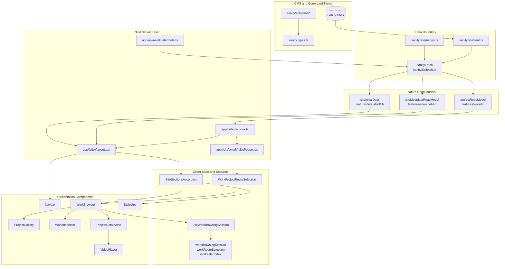
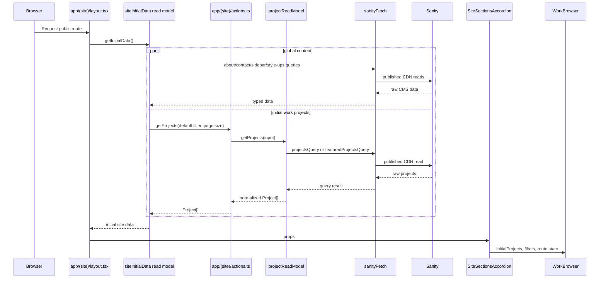
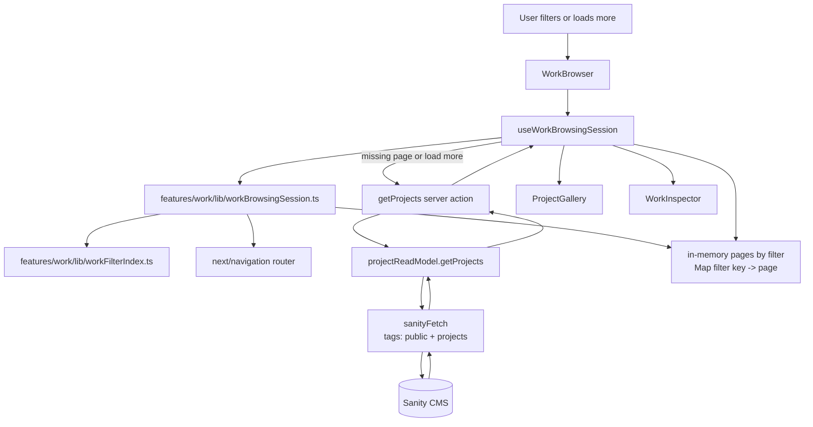
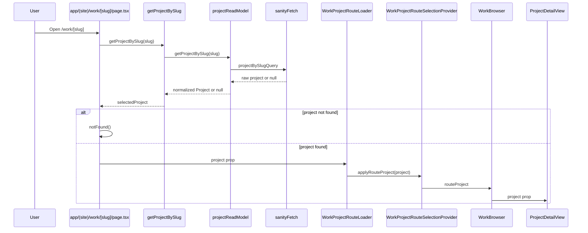
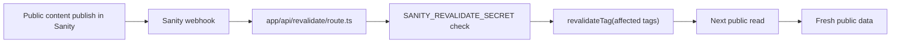
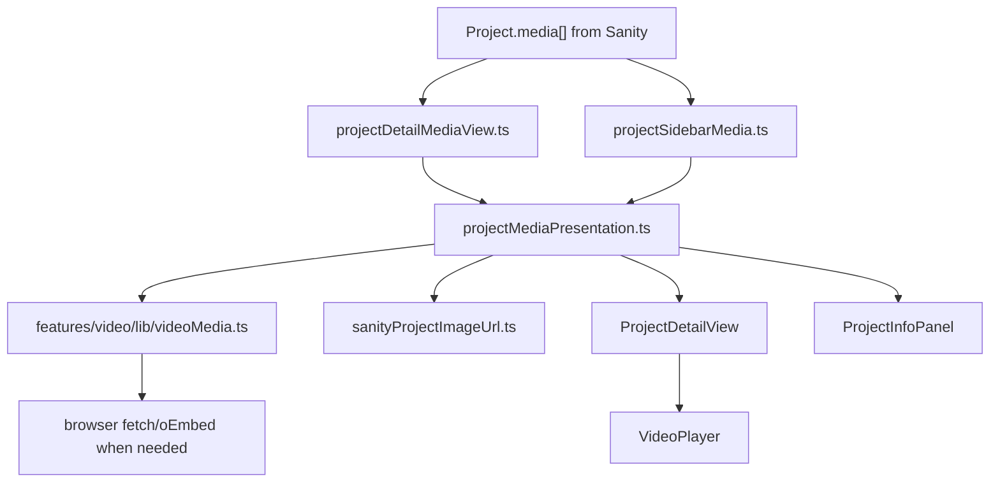

# Architecture

This app follows a server-first read flow:

```text
Sanity CMS -> Sanity fetch boundary -> feature read models -> Next routes/layouts
-> client session hooks -> presentational components
```

Most Sanity reads happen before the UI is rendered. Client components receive typed initial data, then call server actions only for user-driven refreshes such as filtering and pagination.

## Layer Map



## Initial Site Render

`app/(site)/layout.tsx` owns the first public-site data read. It creates read models, fetches global/site data, fetches the first work page, and passes everything into the client shell.



## Work Browsing

The work browsing UI is client-side, but data refreshes still go through the server action and read model. The hook owns live browsing state; pure `features/work/lib/*` modules own deterministic calculations.



## Project Detail Route

Project details are route-backed. The server route fetches the selected project, then a small client loader stores it in route-selection context so the always-mounted work browser can render the detail view inside the accordion.



## Cache Invalidation

Public Sanity reads use cache tags only, with no timed revalidation windows. Sanity can invalidate affected tags through the webhook route.



## Media Presentation

Project media is fetched as part of project data. Presentation logic chooses how to render images, local videos, and external videos. External video thumbnail fallback is centralized in `features/video/lib/videoMedia.ts`.



## Rule of Thumb

New data-backed features should usually follow this shape:

1. Put GROQ in `sanity/lib/queries.ts`.
2. Put fetch orchestration and normalization in the owning feature's `lib/` read model.
3. Use a route, layout, or server action as the server boundary.
4. Pass typed data into client components as props.
5. Put complex interactive state in a hook and deterministic state transitions in a tested feature `lib/` module.
