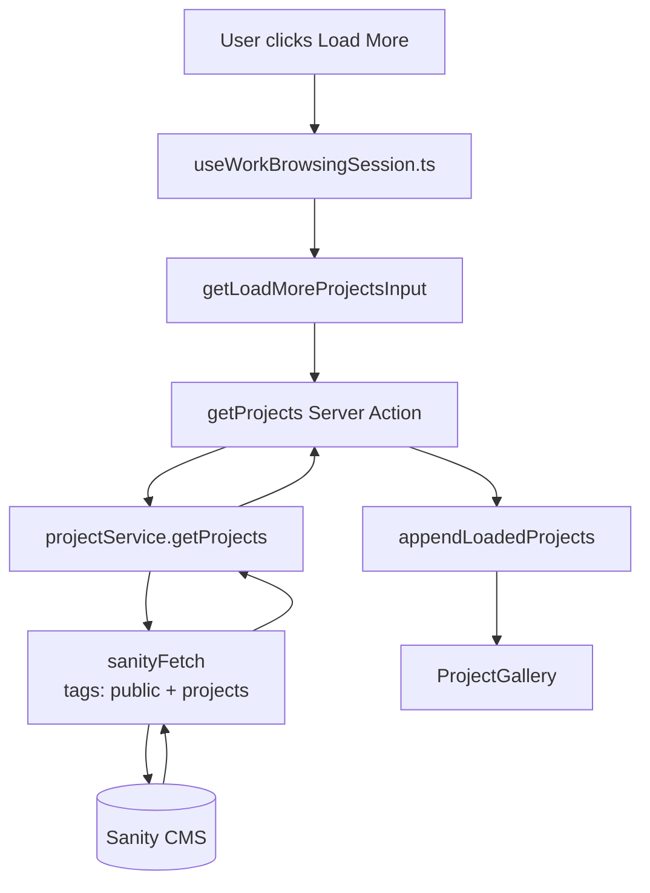
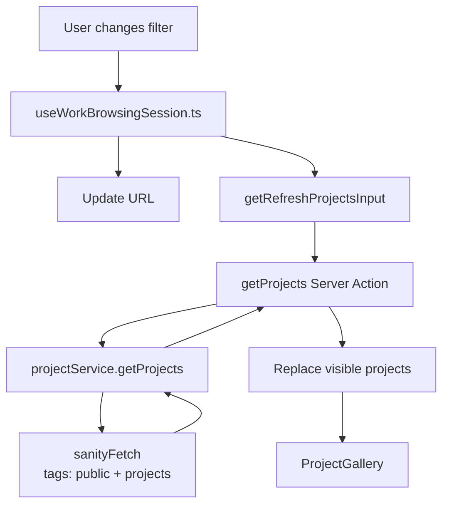
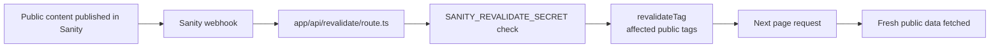

# Data Fetching

This app fetches public Sanity data through `sanityFetch` in `sanity/lib/fetch.ts`.

`sanityFetch` uses:

- published Sanity content only
- Sanity CDN reads
- Next cache tags with on-demand webhook invalidation
- public Sanity cache tags for site shell, project, Style Ups, and SEO reads

## Overview

```mermaid
flowchart TD
    Sanity[(Sanity CMS)]
    Client[Sanity client<br/>sanity/lib/client.ts]
    Fetch[sanityFetch<br/>sanity/lib/fetch.ts]
    Actions[getProjects / getProjectBySlug<br/>app/(site)/actions.ts]
    Layout[Initial page data<br/>app/(site)/layout.tsx]
    WorkSession[Client browsing session<br/>useWorkBrowsingSession.ts]
    DetailRoute[Project detail route<br/>work/[slug]/page.tsx]
    DetailView[ProjectDetailView<br/>renders fetched project]

    Sanity --> Client
    Client --> Fetch
    Fetch --> Layout
    Fetch --> Actions
    Actions --> WorkSession
    Actions --> DetailRoute
    DetailRoute --> DetailView
```

## Initial Work Data

Initial work data is fetched in `app/(site)/layout.tsx`.

The layout fetches:

- about content
- contact content
- sidebar filter data
- style-ups
- initial projects

Initial projects are loaded by calling `getProjects` from `app/(site)/actions.ts` with:

```ts
filter: DEFAULT_PROJECT_FILTER
limit: PROJECTS_PAGE_SIZE
```

`PROJECTS_PAGE_SIZE` lives in `lib/workBrowsingConfig.ts`.

```mermaid
flowchart LR
    Layout[app/(site)/layout.tsx]
    Fetch[sanityFetch]
    Actions[getProjects]
    Config[PROJECTS_PAGE_SIZE]
    Accordion[SiteSectionsAccordion]
    WorkBrowser[WorkBrowser]

    Layout --> Fetch
    Layout --> Actions
    Config --> Layout
    Fetch --> Layout
    Actions --> Layout
    Layout --> Accordion
    Accordion --> WorkBrowser
```

## Project Reads

Project read logic lives in `features/work/services/projectService.ts`.

It exposes:

- `getProjects`
- `getProjectBySlug`

The service receives `sanityFetch` as a dependency from `app/(site)/actions.ts`. The service adds `sanity:public` and `sanity:projects` cache tags to project reads.

## Load More

Load more is triggered from the client in `features/work/components/WorkBrowser/useWorkBrowsingSession.ts`.

It calls the `getProjects` Server Action from `app/(site)/actions.ts`.

The next request includes the current filter, cursor, and `PROJECTS_PAGE_SIZE`. The returned projects are appended to the current visible project list.



## Filtering

Filtering is handled in `features/work/components/WorkBrowser/useWorkBrowsingSession.ts`.

When the filter changes:

- the filter state is updated
- the URL is updated
- `getProjects` is called again with the new filter
- the visible project list is replaced with the returned projects

Filter URL parsing and navigation helpers live in:

- `lib/workFilterIndex.ts`
- `lib/workBrowsingSession.ts`



## Project Details Route

Project detail pages live at `app/(site)/work/[slug]/page.tsx`.

The route fetches the selected project with `getProjectBySlug(slug)`.

If no project is found, the route calls `notFound()`.

If a project is found, it is passed to `WorkProjectRouteLoader`.

## Project Detail View

`WorkProjectRouteLoader` stores the route project in `WorkProjectRouteSelectionProvider`.

`features/work/components/WorkBrowser/WorkBrowser.tsx` reads that context and renders `ProjectDetailView` when the current route is a project detail route.

`features/work/components/ProjectDetailView/ProjectDetailView.tsx` does not fetch Sanity data. It receives the already-fetched project as a prop and renders the project media.

`features/work/components/WorkInspector/ProjectInfoPanel.tsx` also receives the project as a prop. It may fetch Vimeo oEmbed thumbnail data in the browser when a video URL has no Sanity thumbnail and no direct provider thumbnail.

```mermaid
flowchart TD
    Link[User opens /work/slug]
    Route[work/[slug]/page.tsx]
    Action[getProjectBySlug]
    Service[projectService.getProjectBySlug]
    Fetch[sanityFetch<br/>tags: public + projects]
    Loader[WorkProjectRouteLoader]
    Context[WorkProjectRouteSelectionProvider]
    WorkBrowser[WorkBrowser]
    DetailView[ProjectDetailView]
    Inspector[ProjectInfoPanel]

    Link --> Route
    Route --> Action
    Action --> Service
    Service --> Fetch
    Fetch --> Service
    Service --> Action
    Action --> Route
    Route --> Loader
    Loader --> Context
    Context --> WorkBrowser
    WorkBrowser --> DetailView
    WorkBrowser --> Inspector
```

## Cache Invalidation

Public Sanity reads use explicit cache tags and do not use timed revalidation windows.

`app/api/revalidate/route.ts` exposes a webhook endpoint for Sanity. When supported public document types are published, Sanity can call this route with `SANITY_REVALIDATE_SECRET`, and the route revalidates the tags affected by that document type.

The public tags are:

- `sanity:public`
- `sanity:projects`
- `sanity:site-shell`
- `sanity:style-ups`
- `sanity:seo`


