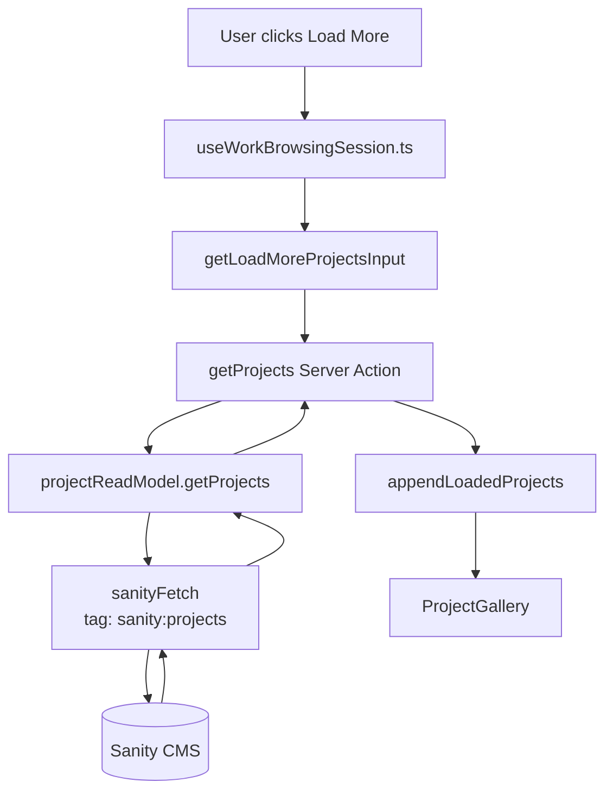
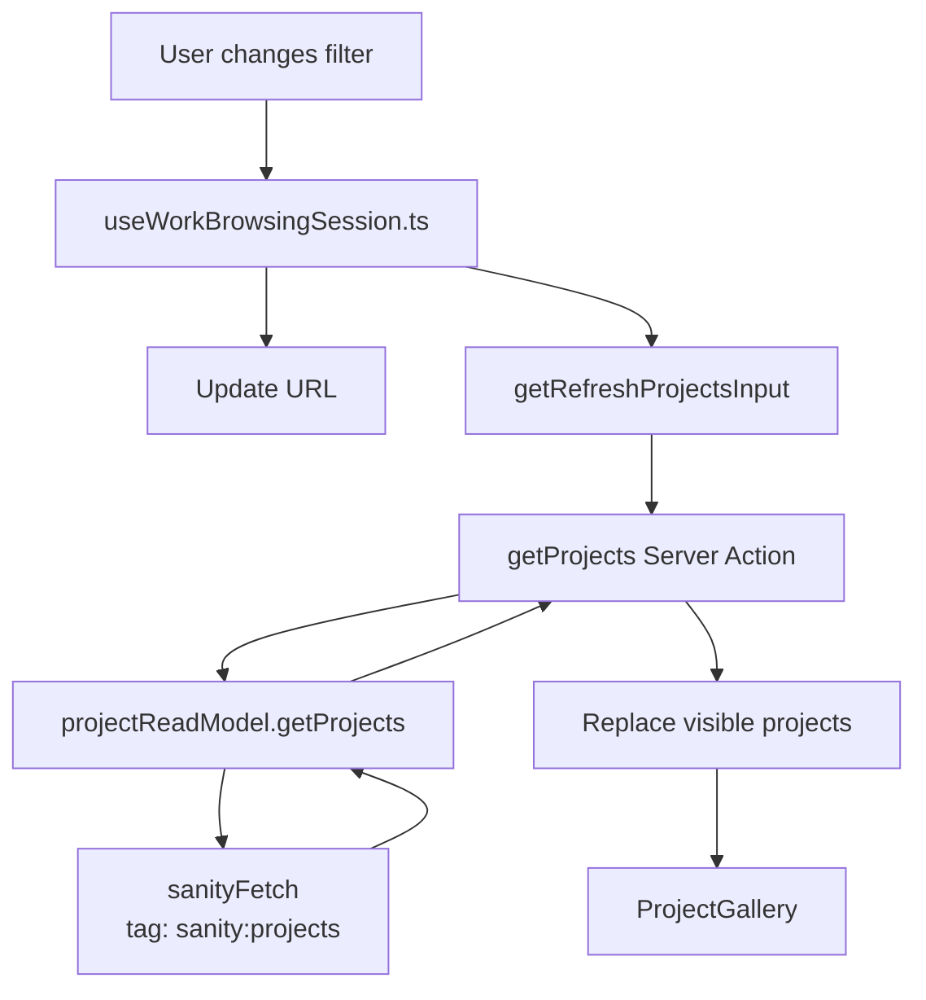
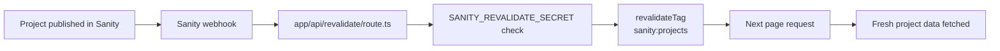

# Data Fetching

This app fetches public Sanity data through `sanityFetch` in `sanity/lib/fetch.ts`.

`sanityFetch` uses:

- published Sanity content only
- Sanity CDN reads
- Next revalidation, defaulting to 60 seconds
- the `sanity:projects` cache tag for project-related reads

## Overview

```mermaid
flowchart TD
    Sanity[(Sanity CMS)]
    Client[Sanity client<br/>sanity/lib/client.ts]
    Fetch[sanityFetch<br/>sanity/lib/fetch.ts]
    Actions[getProjects / getProjectBySlug<br/>app/(site)/actions.ts]
    Layout[Initial page data<br/>app/(site)/layout.tsx]
    WorkSession[Client browsing session<br/>useWorkBrowsingSession.ts]
    DetailRoute[Project detail route<br/>work/[slug]/page.tsx]
    DetailView[ProjectDetailView<br/>renders fetched project]

    Sanity --> Client
    Client --> Fetch
    Fetch --> Layout
    Fetch --> Actions
    Actions --> WorkSession
    Actions --> DetailRoute
    DetailRoute --> DetailView
```

## Initial Work Data

Initial work data is fetched in `app/(site)/layout.tsx`.

The layout fetches:

- about content
- contact content
- sidebar filter data
- style-ups
- initial projects

Initial projects are loaded by calling `getProjects` from `app/(site)/actions.ts` with:

```ts
filter: DEFAULT_PROJECT_FILTER
limit: PROJECTS_PAGE_SIZE
```

`PROJECTS_PAGE_SIZE` lives in `lib/workBrowsingConfig.ts`.

```mermaid
flowchart LR
    Layout[app/(site)/layout.tsx]
    Fetch[sanityFetch]
    Actions[getProjects]
    Config[PROJECTS_PAGE_SIZE]
    Accordion[AccordionNav]
    WorkSection[WorkSection]

    Layout --> Fetch
    Layout --> Actions
    Config --> Layout
    Fetch --> Layout
    Actions --> Layout
    Layout --> Accordion
    Accordion --> WorkSection
```

## Project Reads

Project read logic lives in `lib/projectReadModel.ts`.

It exposes:

- `getProjects`
- `getProjectBySlug`

The read model receives `sanityFetch` as a dependency from `app/(site)/actions.ts`. That file adds the `sanity:projects` cache tag to project reads.

## Load More

Load more is triggered from the client in `components/WorkSection/useWorkBrowsingSession.ts`.

It calls the `getProjects` Server Action from `app/(site)/actions.ts`.

The next request includes the current filter, cursor, and `PROJECTS_PAGE_SIZE`. The returned projects are appended to the current visible project list.



## Filtering

Filtering is handled in `components/WorkSection/useWorkBrowsingSession.ts`.

When the filter changes:

- the filter state is updated
- the URL is updated
- `getProjects` is called again with the new filter
- the visible project list is replaced with the returned projects

Filter URL parsing and navigation helpers live in:

- `lib/workFilterIndex.ts`
- `lib/workBrowsingSession.ts`



## Project Details Route

Project detail pages live at `app/(site)/work/[slug]/page.tsx`.

The route fetches the selected project with `getProjectBySlug(slug)`.

If no project is found, the route calls `notFound()`.

If a project is found, it is passed to `ProjectRouteBridge`.

## Project Detail View

`ProjectRouteBridge` stores the route project in `ProjectRouteContext`.

`components/WorkSection/WorkSection.tsx` reads that context and renders `ProjectDetailView` when the current route is a project detail route.

`components/ProjectDetailView/ProjectDetailView.tsx` does not fetch Sanity data. It receives the already-fetched project as a prop and renders the project media.

`components/Sidebar/ProjectDetails.tsx` also receives the project as a prop. It may fetch Vimeo oEmbed thumbnail data in the browser when a video URL has no Sanity thumbnail and no direct provider thumbnail.

```mermaid
flowchart TD
    Link[User opens /work/slug]
    Route[work/[slug]/page.tsx]
    Action[getProjectBySlug]
    ReadModel[projectReadModel.getProjectBySlug]
    Fetch[sanityFetch<br/>tag: sanity:projects]
    Bridge[ProjectRouteBridge]
    Context[ProjectRouteContext]
    WorkSection[WorkSection]
    DetailView[ProjectDetailView]
    SidebarDetails[ProjectDetails sidebar]

    Link --> Route
    Route --> Action
    Action --> ReadModel
    ReadModel --> Fetch
    Fetch --> ReadModel
    ReadModel --> Action
    Action --> Route
    Route --> Bridge
    Bridge --> Context
    Context --> WorkSection
    WorkSection --> DetailView
    WorkSection --> SidebarDetails
```

## Revalidation

Project reads use the `sanity:projects` cache tag.

`app/api/revalidate/route.ts` exposes a webhook endpoint for Sanity. When a project is published, Sanity can call this route with `SANITY_REVALIDATE_SECRET`, and the route revalidates the `sanity:projects` tag.


